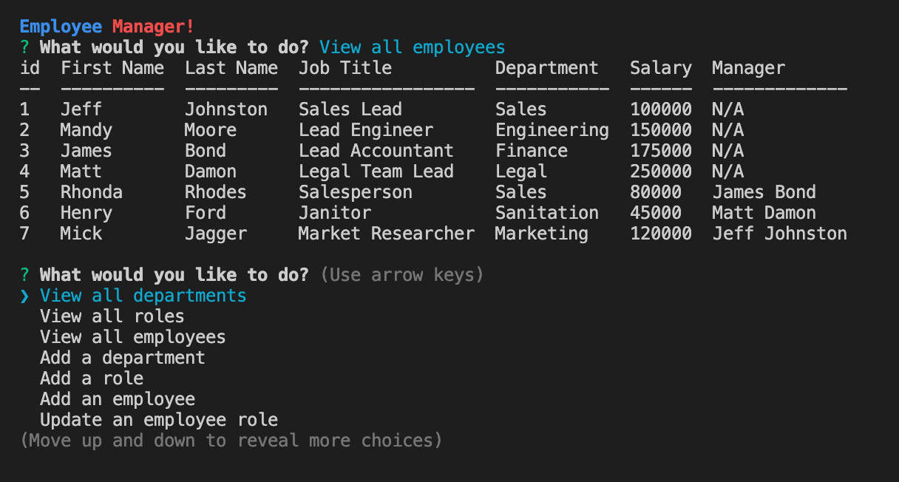

# employee-tracker

## Description 
Employee Tracker is an interactive, MySQL and Node.js-driven application that captures company data as user input via npm package Inquirer. The data is then stored in a MySQL database for convenient retrieval and editing. 

## Table of Contents
* [Installation](#installation) 
* [Usage](#usage) 
* [License](#license) 
* [Contributing](#contributing)
* [Tests](#tests)  
* [Questions](#questions)

 
### Installation
  Clone or fork the code from the Employee-Tracker repository on GitHub. Open the code in a standard code editing application, such as VS Code.
### Usage
 Open an intregrated terminal and type the command "node index.js." Follow the prompts to generate your custom company database!
### License
  MIT
### Contributing
Employee Tracker is an open source project, and anyone is encourged to contribute by cloning or forking the code and working to improve its function and versatility.

### Tests
Try leaving input fields blank. 

### Questions
    
##### Interested in other projects from this developer? Visit the following GitHub profile:
https://github.com/jeffwjohn
    
##### Send any questions to the following email address:
jeffwjohn@yahoo.com